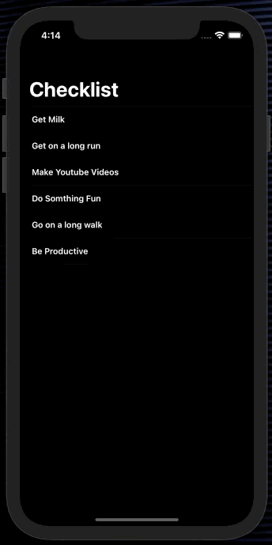

# Checklist-Project
**Checklist** is a simple project, using Autolayout (programmatically - without Storyboard) in **Swift 5.0+** and It can be built by *Xcode 11.0* or later. Compatible with *iOS 13.0/14.0+*.

### Photos Sample

## Requirements

In order to compile **Checklist Project** you will need to meet the following requirements:

* iOS 13.0+ / Mac OS X 10.14+
* Xcode 11.0+
* Swift 5.0+
